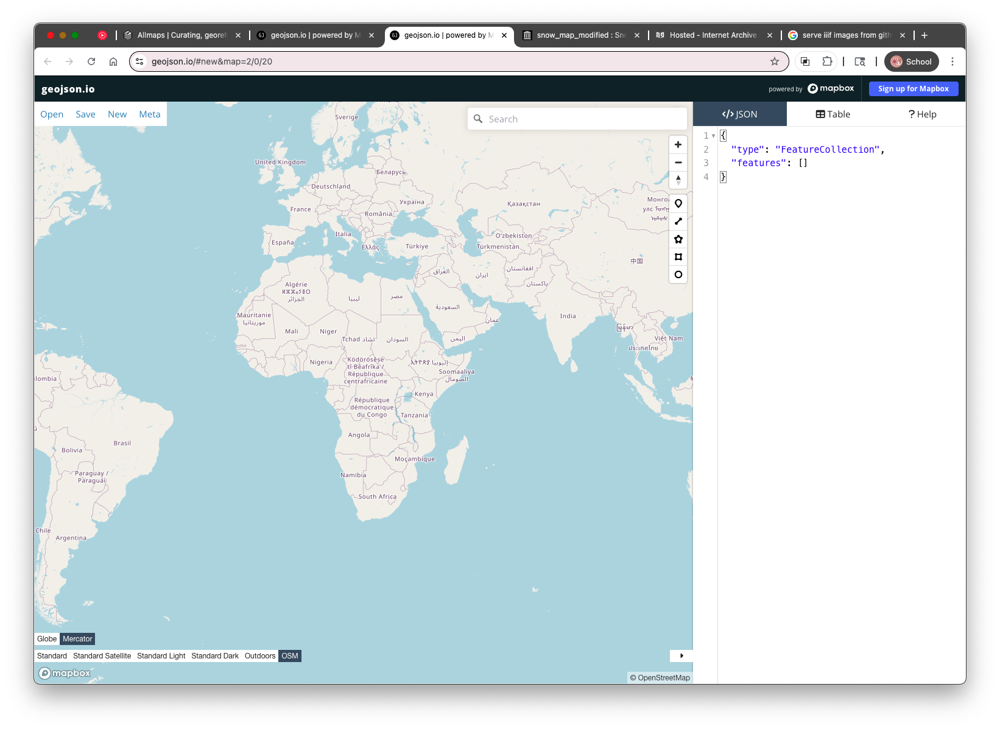
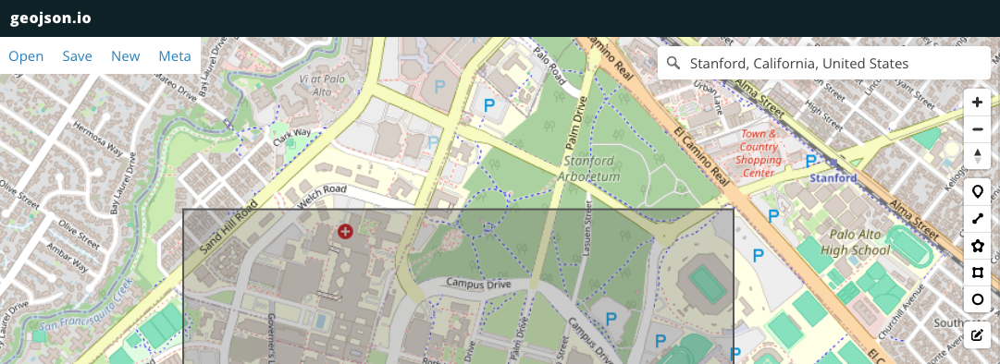
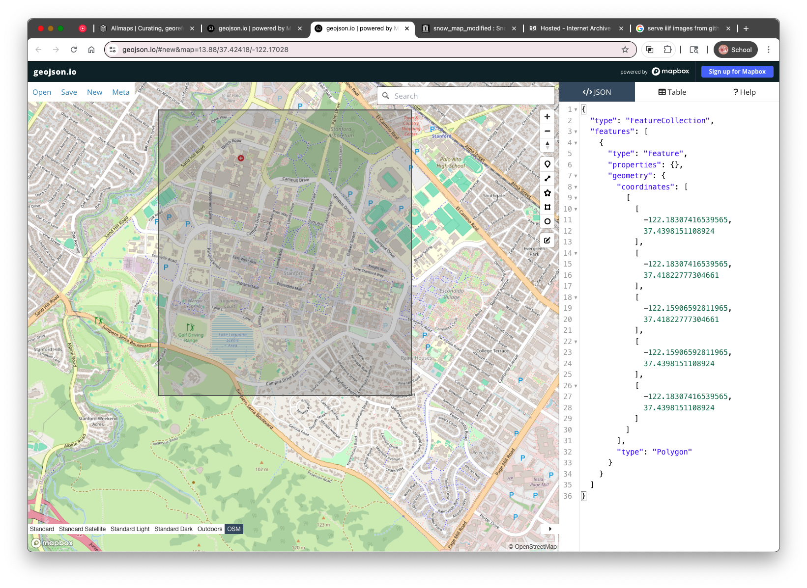
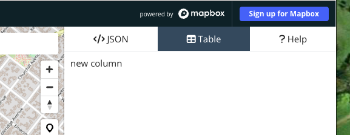
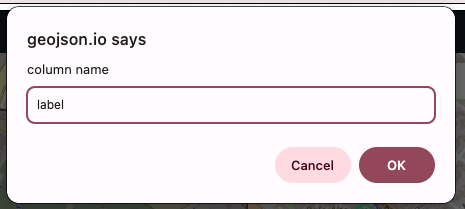
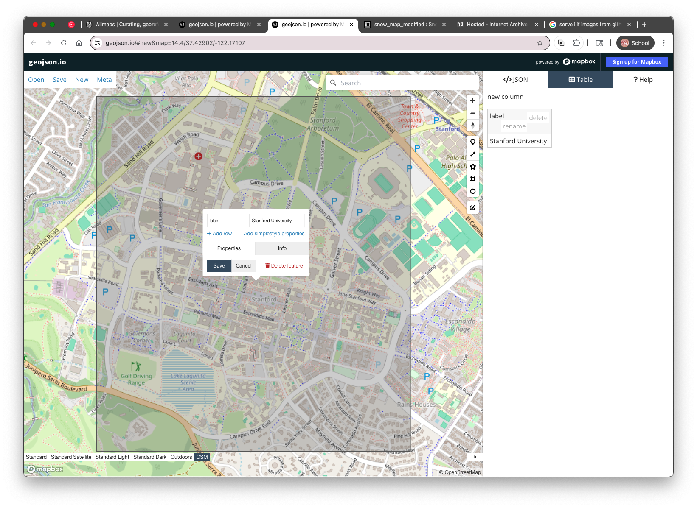

# 1. Intro to geojson.io

[geojson.io](https://geojson.io/) is a free, browser-based tool for working with **geospatial data** — specifically, data in the [GeoJSON](https://geojson.org/) format. GeoJSON is a text-based format that stores geographic features like points, lines, and polygons along with their properties, and it works across many modern mapping tools and platforms.

## What You Can Do with geojson.io

* Draw and edit **points**, **lines**, and **polygons** on a map
* View and edit the **coordinates** and **properties** of each feature
* Add **basemaps**, including custom raster tile layers
* Export your data as `.geojson`, `.kml`, `.csv`, or `.shapefile`
* Copy or paste GeoJSON text to and from other tools

This makes it a great choice for quickly digitizing spatial features — like the **water pumps** on John Snow’s cholera map — and exporting them into formats you can analyze or map later.

## Interface Overview

When you first open the site, you’ll see a split screen:

* **Left side**: A map view where you draw and edit features
* **Right side**: A text editor showing the GeoJSON code of your features

## Creating a Feature

1. **Click the button** for the type of feature you want to add (point, line, or polygon) in the top toolbar.
2. **Click on the map** to place the feature, for example, a bounding box that contains Stanford University's campus.

After you draw something, geojson.io automatically updates the GeoJSON code in the right-hand panel. This is what you can save and share.

## 2. Adding Attributes Using the **Table** Tab

Once you’ve added features to the map in geojson.io (like points for water pumps), you can add descriptive information — such as the name of the street each pump is located on. In GeoJSON, this descriptive data is stored as **properties** , and geojson.io gives you a simple way to edit those using the **Table** tab.

1. Clicking the **“Table”** tab at the top right of the screen switches the view to a spreadsheet-like editor where each row represents a geographic feature, and each column represents an attribute.
   *
2. Click the column header labeled `new column` and rename it to `label`.

   

   This will be used to store the street name or other identifying information for each pump.
3. Click in the cell under the `label` column and type a value, such as `Stanford University`, in this example.
4. You can also click directly on a point in the map and use the **Properties** popup to add or edit the `label`.

   

---

This is the basic workflow you'll use in the next steps — but instead of Stanford, we'll be adding **water pumps from John Snow’s 1854 map** , labeling each with its nearest street. The next section will show you how to bring in that historic map so you can start digitizing directly on top of it.

Up next: **Adding the Snow Map as a Raster Tile Layer** so you can digitize from the historical map directly.

