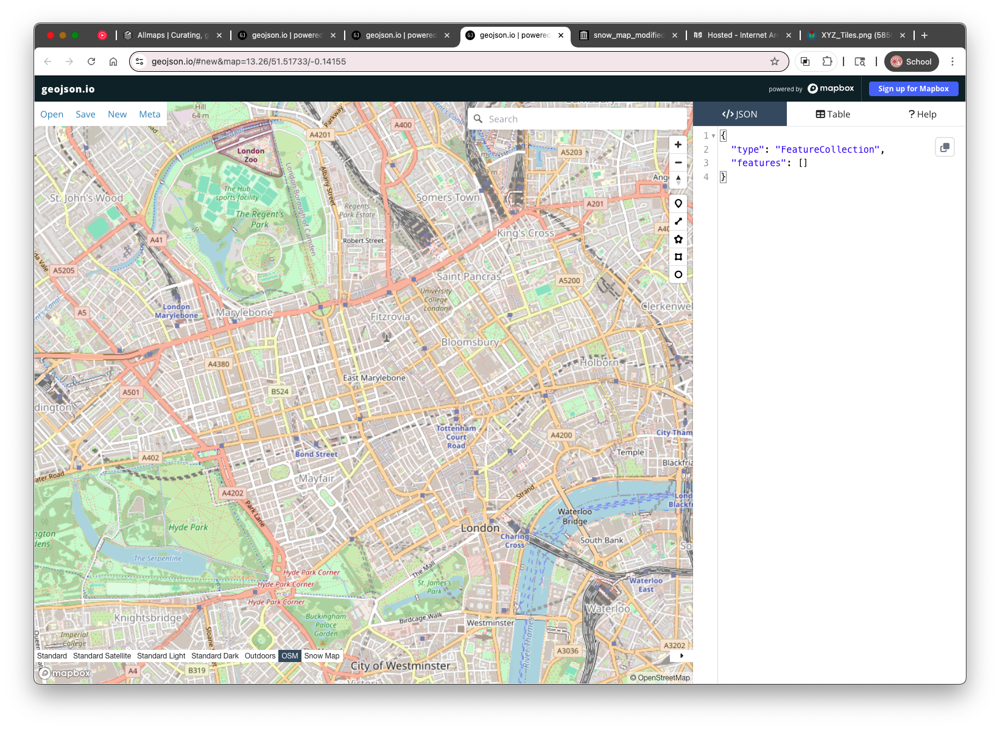
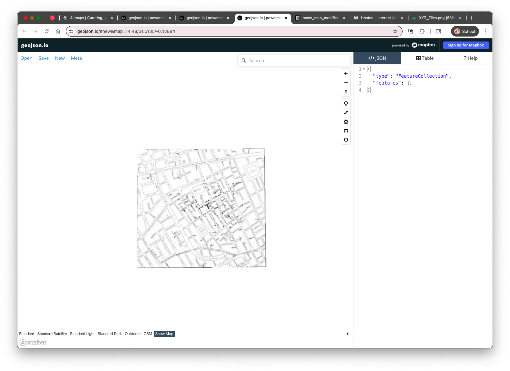

# 3. Adding the Snow Map as a Raster Tile Layer

To digitize water pumps directly on top of John Snow’s 1854 cholera map, we’ll bring that map into geojson.io using a **custom raster tile layer**.

geojson.io supports adding **XYZ tile layers**, which are a standard way of serving tiled maps over the web.

---

## What Are XYZ Tiles?


Modern web maps (like OpenStreetMap or Google Maps) use **tiled imagery**: maps are cut into 256×256 pixel square tiles arranged in a grid. These tiles are fetched using a URL pattern based on:

* `z` – the zoom level
* `x` – the horizontal tile index (column)
* `y` – the vertical tile index (row)

An **XYZ tile URL template** lets your browser fetch and display only the tiles needed for your current map view. Here's the one we’ll use:

```plaintext
https://allmaps.xyz/images/45bbc7ea6e45e5c9/{z}/{x}/{y}.png
```

This URL will serve tiles from our georeferenced version of the Snow map.

---

## Coordinate Reference System (CRS)

These tiles use the **Web Mercator projection** (EPSG:3857), the same projection used by geojson.io’s default basemaps. This ensures the Snow map tiles will align spatially with features you draw in geojson.io — even if the historical map doesn’t cover the whole modern map background.

---

## How to Add the Snow Map Tile Layer in geojson.io

1. Open [geojson.io](https://geojson.io/)
2. Click **“Meta”** in the upper-left menu
3. Select **“Add raster tile layer…”**
4. Paste this XYZ tile URL into the dialog:

   ```plaintext
   https://allmaps.xyz/images/45bbc7ea6e45e5c9/{z}/{x}/{y}.png
   ```


1. Give it the `Layer name`: Snow Map.

   
2. Click **“OK”**

**Note:** geojson.io only allows you to *replace* the default basemap, not layer a custom tile map on top of it. This means you’ll lose the street basemap while viewing the Snow map tiles.

---

## Locating the Snow Map on the Globe

Because the tile layer *replaces* the basemap, it may initially appear as though nothing has been imported — especially if you're zoomed out or not centered on **Soho, London**.

**To find the Snow map:**

* Try zooming in around **Soho, London** (lat/lon approx. `51.513, -0.137`)
* You may need to toggle back to the OSM basemap (via the basemap selection toolbar at the bottom left of the map) to reorient yourself




* Once you find it, you’ll see the historical map “floating” without a modern reference underneath, when you toggle to your Snow Map.



While this isn’t ideal for aligning features visually, we’ll use what we can see on the Snow map (street names and pump symbols) to digitize key locations.

---

In the next section, we’ll begin **digitizing the pump points**, labeling each with its nearest street name using the “label” property we practiced earlier.


* [Introduction](https://github.com/mapninja/Pixels2Points/blob/main/readme.md)
* [Section 02 - Introducing geojson.io](https://github.com/mapninja/Pixels2Points/blob/main/section02.md)
* [Section 03 - Using XYZ Tiles in geojson.io](https://github.com/mapninja/Pixels2Points/blob/main/section03.md)
* [Section 04 - Digitizing features in geojson.io](https://github.com/mapninja/Pixels2Points/blob/main/section04.md)
* [Section 05 - Introducing geojson.io](https://github.com/mapninja/Pixels2Points/blob/main/section05.md)
