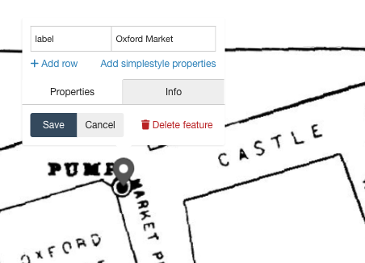
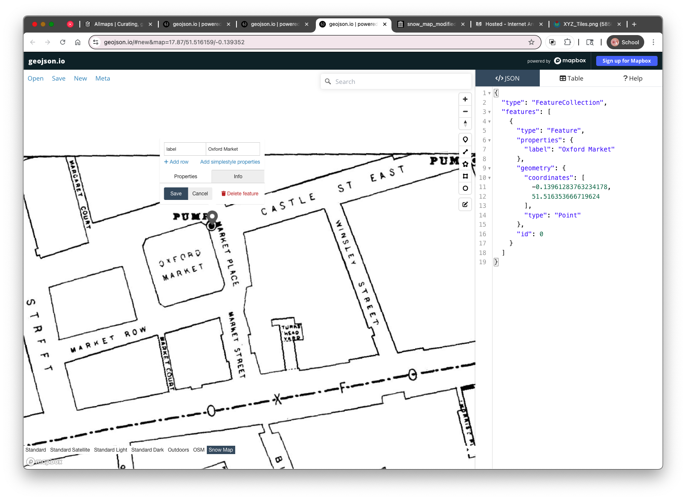
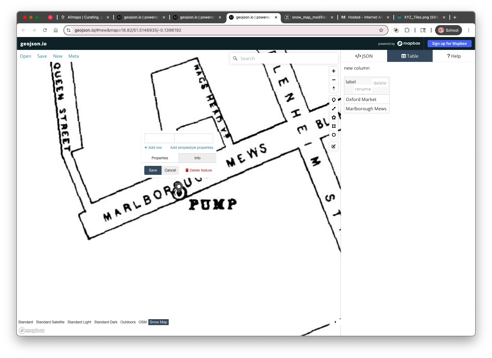
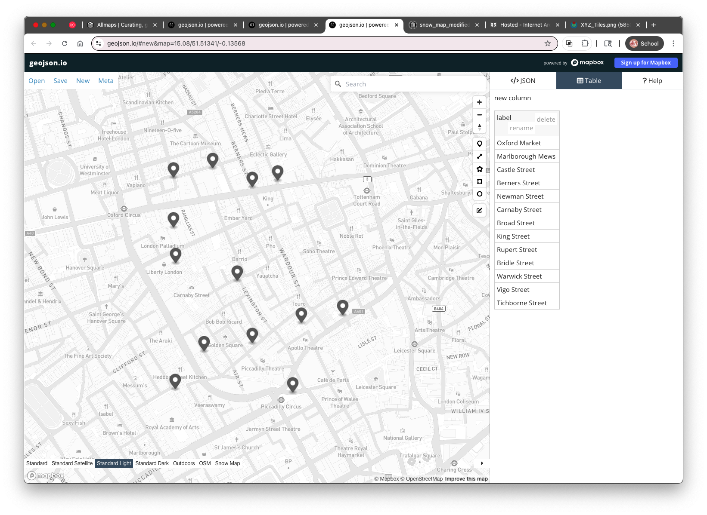

# 4. Digitizing the Water Pumps from the Snow Map

Now that the **John Snow cholera map** is loaded as a raster tile layer in geojson.io, you’re ready to begin **digitizing the water pumps**. Each pump is represented by a small black dot inside a larger circle — like a target — on the historic map. We’ll add a **point feature** for each pump and label it with the name of the nearest street using a property called `label`.

---

## Step-by-Step: Add a Water Pump Feature

1. **Make sure the Snow map tile layer is loaded**
   If you can't see the historic map, revisit **Section 3** to reload the XYZ tile URL and zoom into Soho, London.
2. In the geojson.io toolbar (above the map), click the **Point tool** (a small pin icon)
3. **Click directly on a water pump symbol** in the Snow map to add a point
4. **Click** on the newly created point.
5. A popup will appear for that feature. In the popup:

   * **Click** in the first cell and name the property `label`
   * In the value field (second cell), type the name of the street the pump is located on (e.g., `Oxford Market`)
   * Click **Save**

---

## Tips for Digitizing Accurately

* Zoom in closely to make sure the point is centered on the pump symbol
* Use street names printed on the historic map, even if they differ from modern ones
* Avoid overlapping points or double-clicking by accident

---

## Repeat for Each Pump

Continue adding a new point for **each water pump** shown on the map. For each one:

* Use the **Point tool**
* Place it on the pump symbol
* Add or update the `label` property with the correct street name

You can update labels as you digitize (each new point gets an empty row in the Tabel view). The Table view is also useful for managing properties especially if you need to fix typos or check for missing data.

---

Once all thirteen (13) pumps are digitized and labeled, you can change the basemap to one of the choices at teh bottom of the map and view your first historical spatial dataset, in a modern spatial context! In the next section, we’ll learn how to **save and export** your data from geojson.io as a `.geojson` file.

* [Introduction](https://github.com/mapninja/Pixels2Points/blob/main/readme.md)
* [Section 02 - Introducing geojson.io](https://github.com/mapninja/Pixels2Points/blob/main/section02.md)
* [Section 03 - Using XYZ Tiles in geojson.io](https://github.com/mapninja/Pixels2Points/blob/main/section03.md)
* [Section 04 - Digitizing features in geojson.io](https://github.com/mapninja/Pixels2Points/blob/main/section04.md)
* [Section 05 - Introducing geojson.io](https://github.com/mapninja/Pixels2Points/blob/main/section05.md)
