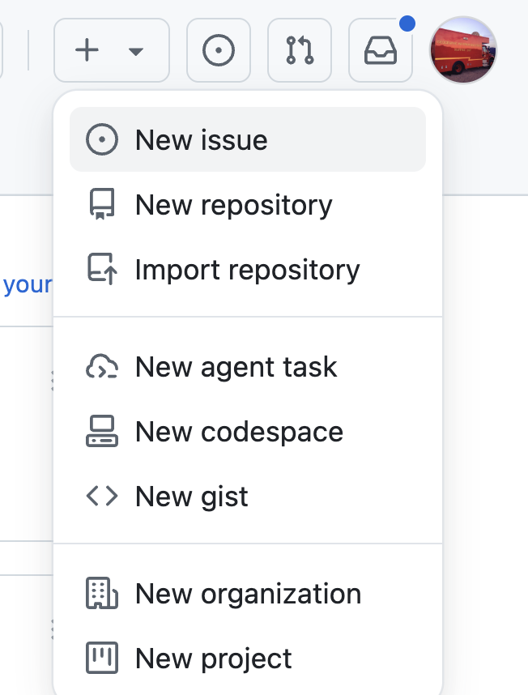

## 6. Uploading Your GeoJSON to GitHub

Once you’ve saved your `snow_water_pumps.geojson` file, you can share it publicly by uploading it to **GitHub**, a platform for hosting code and data. GitHub has a great feature: it **automatically renders** GeoJSON files as interactive maps.

You’ll also learn how to get a **direct raw file URL**, which you can use to load your data into other web mapping tools like Leaflet, Mapshaper, or even geojson.io again.

---

### Step-by-Step: Uploading to a GitHub Repository

1. **Log in to GitHub** (or create a free account if you don’t have one)
2. Click the **+ icon** in the upper right corner and choose **"New repository"**




1. Name the repository:
   `snow_data`
5. Add an optional description, then click **“Create repository”**
6. On the new repo page, click **“Add file” → “Upload files”**
7. Drag and drop your `snow_water_pumps.geojson` file into the upload area
8. Scroll down and click **“Commit changes”**

<br>


*Alt text: Screenshot of GitHub’s file upload page with a GeoJSON file dragged into the drop area and the “Commit changes” button below.*

<br>

---

### Viewing the Auto-Rendered Map

Once the file is uploaded, GitHub will automatically detect that it's a GeoJSON file and show a **preview map** at the bottom of the file view page.

<br>


*Alt text: Screenshot of GitHub’s auto-rendered map for a GeoJSON file, showing the file above and a live map preview below.*

<br>

This preview allows you to zoom in and explore the points you digitized — a great way to check your work or share it with others.

---

### Getting the Raw File URL for Web Maps

If you want to use your GeoJSON file in another web mapping tool, you need the **raw URL**.

1. In the GitHub repo, click on your file name (`snow_water_pumps.geojson`)
2. Click the **“Raw”** button (near the top right)
3. Copy the **URL from your browser’s address bar** — it will look something like:

```plaintext
https://raw.githubusercontent.com/your-username/snow_data/main/snow_water_pumps.geojson
```

This is the direct link to the GeoJSON file itself — and it can be used in tools that accept remote URLs, like [geojson.io](https://geojson.io), [Leaflet.js](https://leafletjs.com), or even [Mapshaper](https://mapshaper.org/).

---

In the final section, we'll create a simple web map, using the data we have created, and serve it from Github, as well.
